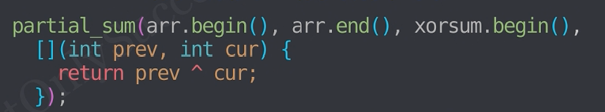
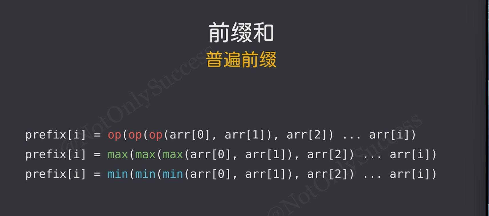
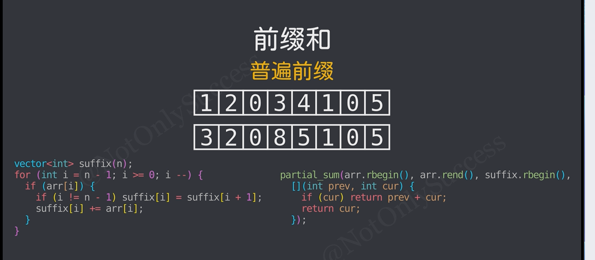

# 前缀和

> prefix表示前缀和，由一个用户输入的数组生成
>
> prefix为预处理算法，只适用于静态数组，一边修改一边查询需要使用树状数组或线段树等

```c++
prefix[i] = E(i,j=1)a[j]
prefix[i] = E(i-1,j=1)a[j] + a[i]
```

## 由数组生成prefix：
```c++
vector<int> prefix(n);

for(int i=0;i<n;i++){
    if (i) prefix[i] = prefix[i-1]+arr[i];
    prefix[i]+=arr[i]; //i等于0时，i-1越界，要特殊处理
}

//以上等价于：
#include <numeric>
vector<int> prefix(arr.size());//必须给prefix初始化
partial_sum(arr.begin(),arr.end(),prefix.begin());
//            起始        终止          目标位置
```
若数组后续不再使用：
```c++
vector<int> prefix(n);

for(int i=0;i<n;i++){
    int x;cin>>x;
    if (i) prefix[i] = prefix[i-1]+x;
    prefix[i]+=x; //i等于0时，i-1越界，要特殊处理
}
```

## 时间复杂度O(1)的求数组a的区间 L,R 的和：
```c++
auto sum=[&](int l,int r){
    if (l==0)return prefix[r];
    return prefix[r]-prefix[l-1];
};
```

## 拓展
前缀和可以用在积，异或等满足结合律、可逆的运算上

前缀积取模：
```c++
//防止乘积溢出，前缀取模，需要乘法逆元
preifx[i]=(prefix[i-1]*arr[i])%mod;
……
```
前缀积：
```c++
mul(L,R)=[&](int l,int r){
    if (l==0)return prefix[r];
    return prefix[r]/prefix[l-1];
}
```
前缀异或：
```c++
_xor(L,R)=[&](int l,int r){
    if (l==0)return prefix[r];
    return prefix[r]^prefix[l-1];
}
```
也可为partial_sum()添加第四个参数：


## 二维前缀
运用容斥原理，在二维数组中快速求出任意子矩阵的和：
```c++
vector<vector<int>> arr(m,vector<int>(n));
vector<vector<int>> prefix(m,vector<int>(n,0));

for (int i=0;i<m;++i){
    for (int j=0;j<n;j++){
        int top=(i>0)?prefix[i-1][j]:0;
        int left=(j>0)?prefix[i][j-1]:0;
        int top_left=(i>0&&j>0)?prefix[i-1][j-1]:0;
        
        prefix[i][j]=arr[i][j]+top+left-top_left;
        //当前面积 = 原值 + 上边面积 + 左边面积 - 左上角重复面积
    }
}
auto sum=[&](int x1,int y1,int x2,int y2){
    int top=(i>0)?prefix[x1-1][y2]:0;
    int left=(j>0)?prefix[x2][y1-1]:0;
    int top_left=(i>0&&j>0)?prefix[x1-1][y1-1]:0;
    return prefix[x2][y2]-top-left+top_left;
    //当前面积 = 原值 + 上边面积 + 左边面积 - 左上角重复面积
};
```

```c++
vector<vector<int>> arr(m, vector<int>(n));
vector<vector<int>> prefix(m, vector<int>(n, 0));

// 1. 先对行求前缀和
for (int i = 0; i < m; ++i) {
    for (int j = 0; j < n; ++j) {
        if (j > 0) prefix[i][j] += prefix[i][j - 1];
        prefix[i][j] += arr[i][j];
    }
}

// 2. 再基于第一步的结果，对列求前缀和
for (int j = 0; j < n; ++j) {
    for (int i = 0; i < m; ++i) {
        if (i > 0) prefix[i][j] += prefix[i - 1][j];
    }
}

// 3. 子矩阵查询
auto sum = [&](int x1, int y1, int x2, int y2) {
    int top = (x1 > 0) ? prefix[x1 - 1][y2] : 0;
    int left = (y1 > 0) ? prefix[x2][y1 - 1] : 0;
    int top_left = (x1 > 0 && y1 > 0) ? prefix[x1 - 1][y1 - 1] : 0;
    
   //右下 - 右上(top) - 左下(left) + 左上(top_left)
    return prefix[x2][y2] - top - left + top_left;
};
```

## 普遍前缀

用于多次查询起点到目标位置的某个统计信息

也可使使用后缀运算计算终点到目标位置的某个统计信息
