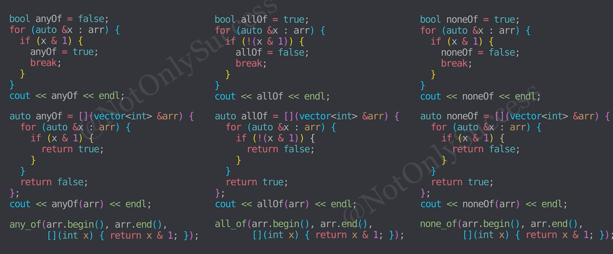
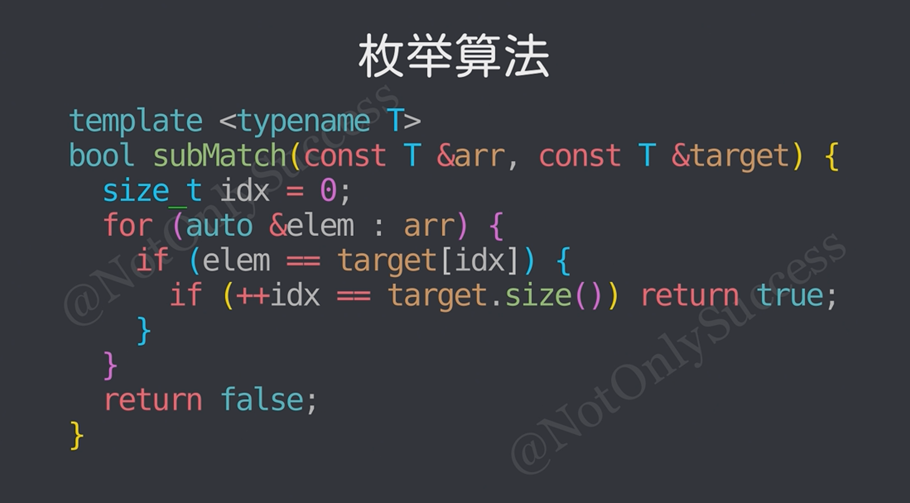
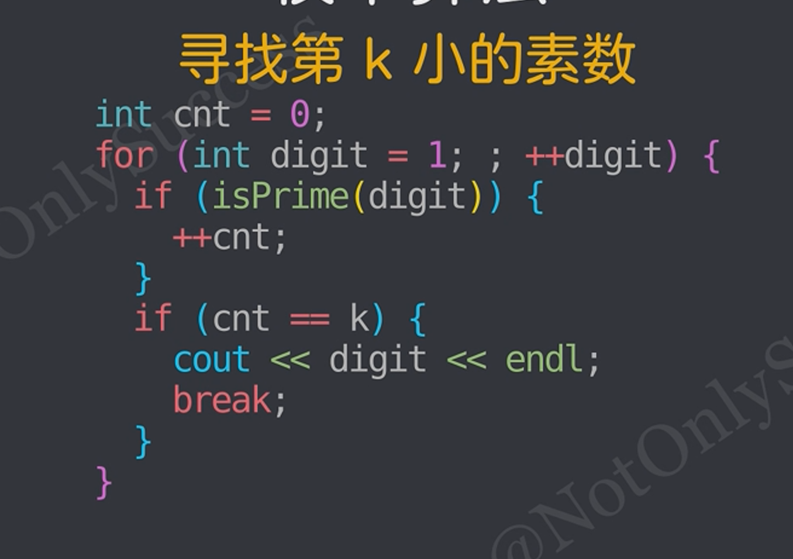
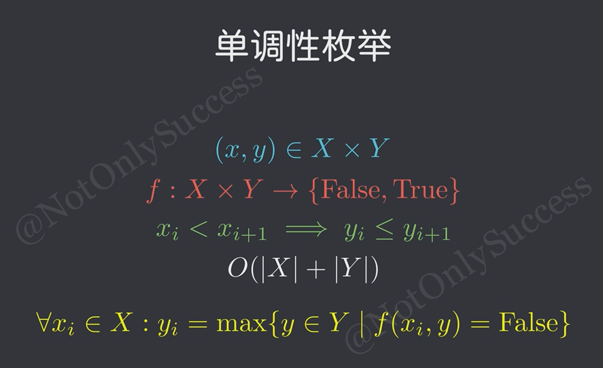

# 枚举
>## 枚举 != 遍历/暴力
>
>## 适用范围：
>* 规模小，解空间可枚举的情况。
>
>## 解空间的类型：
>* 一个范围内的所有数字，二元组、字符串等
>* (解空间树，子集树和排列树，需要用回溯法进行枚举)
>
>## 循环枚举解空间：
>* 首先确定解空间的维度，及问题中需要枚举的变量个数。

>## 基础枚举模型：
>
>* any_of是否存在, all_of全部都, find_if找到第一个, none_of全部都不
>* min_element, max_element, accumulate
>* 通过bool变量flag朴素实现，or 函数实现 or 使用STL

>#### 子串匹配枚举：
>
>* 寻找子数组等于目标
>* find_if枚举到idx为数组长度

>#### 无限集枚举：
>eg1.寻找第k小的素数
>
>eg2.计算n天后的日期
>
>* 在无线集中枚举，同时维护关键信息

>#### 枚举优化：
>* 裁剪枚举集
>* eg1.回文串枚举前一半
>* eg2.判断素数枚举到n^1/2

>#### 按位枚举算法：(本质上是进制转换)
```c++
//10进制的按位枚举
//1.while
while (x){
    int digit=x%10;
    //do something...
    x/=10;
}
//2.for
for (;x;x/=10){
    int digit=x%10;
    //do something...
}
```
```c++
//Base进制的按位枚举
//1.while
while (x){
    int digit=x % Base;
    //do something...
    x/=base;
}
//2.for
for (;x;x /= Base){
    int digit=x%base;
    //do something...
}
```
### 单调性枚举
