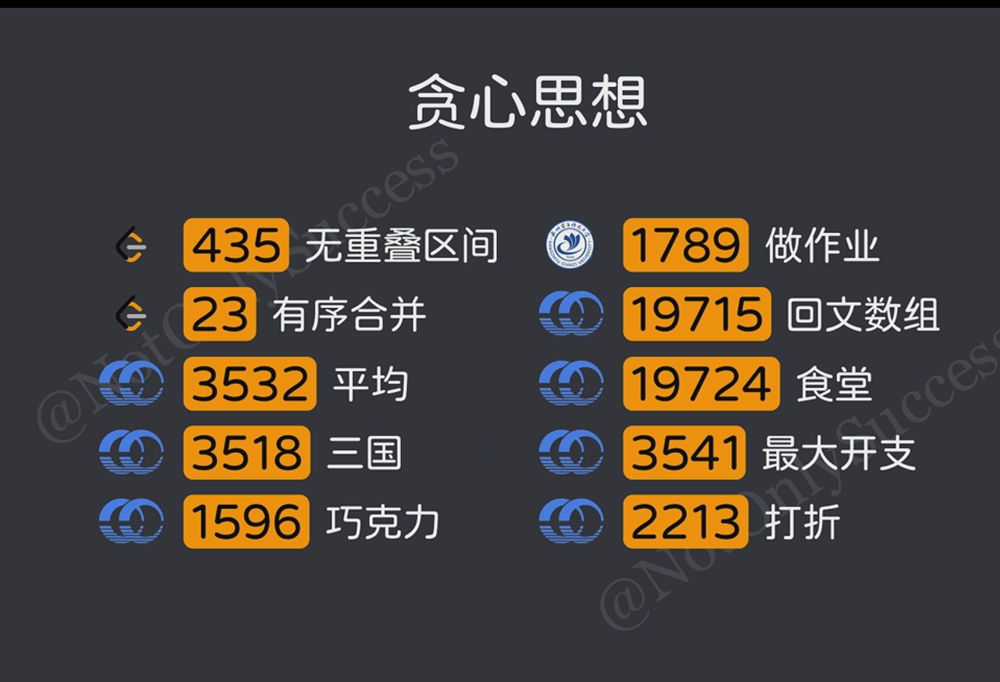

## 贪心
用于求解问题的最优值，每次在多个状态转移的决策中，根据当前状态选择最优的一个

需要证明
---
## EG
* 集合选择问题
* 截止日期问题
* n个有序数组

## 贪心思想
顺序无关，尝试排序

不断尝试，找反例

逆向思维

最佳搭档——优先队列

## 经典算法
* 哈夫曼编码
* 最小生成树
* Dikstra最短路

## 解题步骤
1. 指定某个贪心的策略
> 最大、最小、正向、逆向
2. 证明这个策略的正确性

## 题单

