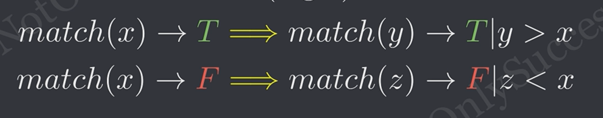

# 二分
关键 -> 两极性

时间复杂度 -> O(log n)

两极性的证明：


实数二分种植条件 -> 范围小于epsion
---

## 二分常见样例
### 有序数组中是否存在目标
* 手写二分
```c++
bool binsearch(int arr[],int n,int s){ 
    int left = 0,right = n-1;
    while(left <= right){ //必须小于等于，否则单个数据时无法查找
		int mid = left+((right-left)>>1); //防止溢出+位运算符效率更高
		if(arr[mid] == s){
			 return true;
		}else if(arr[mid] > s){
                right = mid-1;
		}else{
                left = mid+1;
        } 
    } 
    return false;
}
```
* 使用STL中的binary_search()函数
```c++
auto ans = binary_search(vec.begin(), vec.end(), target);
auto ans = binary_search(arr, arr+n, target);//普通数组
```

* 使用模板
```c++
auto match = [&](int index){
    return arr[index] >= target;
}
int index = get_firt_macth(0,n-1,match)
if (arr[index] == target && index<n)
    return true;
else
    return false;
```
### 有序数组中寻找第一个大于等于目标的下标
* 模板实现
```c++
auto match=[&](int index){
    return arr[index] >= target;
}
int index = get_firt_macth(0,n-1,match)
```
* STL的lower_bound()函数
> 寻找下界，即第一个大于等于目标的下标
```c++
int index = lower_bound(vec.begin(), vec.end(), target) - vec.begin()
int index = lower_bound(arr, arr+n, target) - arr;//普通数组
```

> upper_bound()寻找上界，即第一个大于目标的下标
### 有序数组中寻找最后一个小于目标的下标
```c++
int index = lower_bound(vec.begin(), vec.end(), target) - vec.begin() -1;
int index = lower_bound(arr, arr+n, target) - arr -1;//普通数组
```
```c++
auto match=[&](int index){
    return arr[index] >= target;
}
int index = get_firt_macth(0,n-1,match) - 1;
```

### 二分答案
> 寻找符合某个条件的最大/最小值
> 最大值最小化
> 最小值最大化
> 寻找两极性函数
eg.最多将数组分成m组，每组之和不超过x，求x最小值
```c++
int low = max_element(vec.begin(),vec.end());
int high = accumulate(vec.begin(),vec.end(),0);
int min_x = get_first_match(low, high, macth);
```
