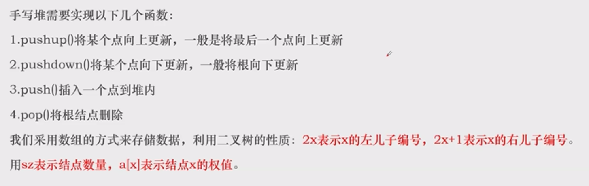

# 堆

---

## 优先列表
例题1.LQ3433

[一道简单的取模问题.cpp](%E4%B8%80%E9%81%93%E7%AE%80%E5%8D%95%E7%9A%84%E5%8F%96%E6%A8%A1%E9%97%AE%E9%A2%98.cpp)

## 堆的结构
以大根堆为例——
堆是一种二叉树，每个节点满足：儿子的权值都比自己的权值小/相等。

该性质不断向上传递，直到根。

根的权值是整棵树中最大的。

## 手写堆
>> 
